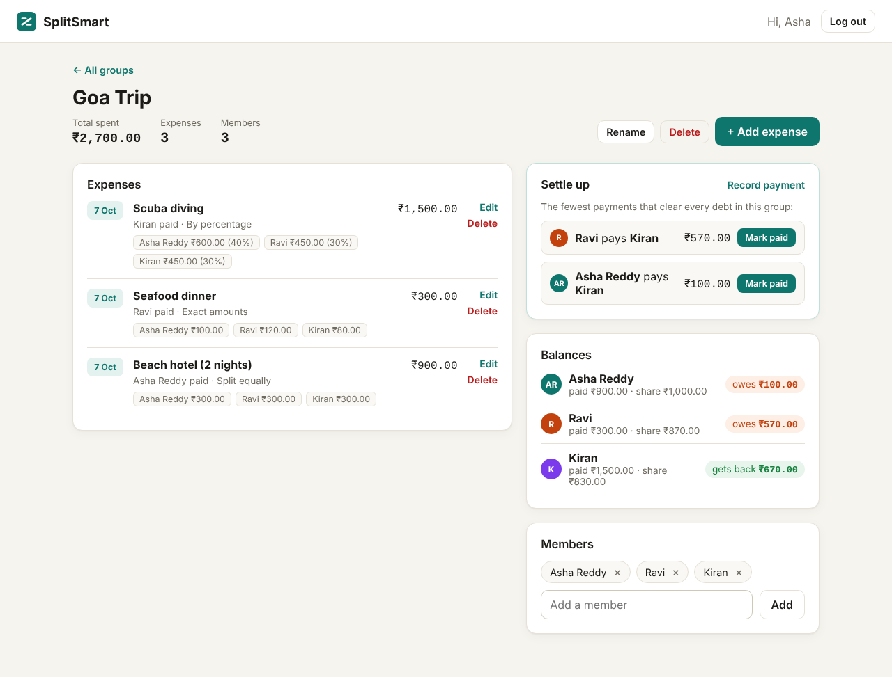

# SplitSmart — Group Expense Settler

A full-stack web app to track shared expenses in a group (trips, flatmates, dinners) and settle up with the **minimum number of payments**.



**Stack:** Java 24 · Spring Boot 3.5 · Spring Security (JWT) · Spring Data JPA · PostgreSQL · React 18 (Vite) · Docker

## Features

- Sign up / log in with **JWT authentication** (passwords hashed with BCrypt); each user sees only their own groups
- Create groups and add members (friends don't need an account)
- Add, edit and delete expenses with three split types: **equal**, **exact amounts**, **percentages**
- Paisa-accurate money handling with `BigDecimal`: shares always add up exactly to the total
- Live balances: what each person paid, their share, and whether they owe or get back
- **Settle up:** greedy min-cash-flow algorithm suggests the fewest payments; one click marks a payment as done
- Record custom payments (e.g. partial UPI transfers) and undo them from the payment history
- Clean JSON error messages and input validation on both frontend and backend
- Responsive UI (desktop and mobile)

## Project structure

```
splitsmart/
├── backend/                          Spring Boot REST API
│   ├── pom.xml
│   ├── Dockerfile
│   └── src/main/java/com/splitsmart/
│       ├── SplitSmartApplication.java
│       ├── model/                    JPA entities: AppUser, ExpenseGroup, Member, Expense, ExpenseSplit, Settlement, SplitType
│       ├── repository/               Spring Data JPA repositories
│       ├── dto/Dtos.java             Request/response records with validation
│       ├── service/                  AuthService, GroupService, ExpenseService, SettlementService,
│       │                             SplitCalculator, SettlementCalculator (pure algorithms)
│       ├── controller/               AuthController, GroupController, ExpenseController, SettlementController
│       ├── security/                 SecurityConfig, JwtService, JwtAuthFilter, CurrentUser
│       └── exception/                GlobalExceptionHandler + custom exceptions
├── frontend/                         React + Vite
│   ├── src/
│   │   ├── api.js                    All API calls (adds the JWT header)
│   │   ├── auth.jsx                  Login state (React Context)
│   │   ├── pages/                    Login, Register, Groups, GroupDetail
│   │   └── components/               ExpenseForm, PaymentForm, Modal, Avatar, Layout
│   ├── nginx.conf
│   └── Dockerfile
├── docker-compose.yml                Postgres + backend + frontend
└── docs/screenshot.png
```

## Run it

### Option A: Local development (recommended while coding)

| Step | What to do |
|---|---|
| 1 | Install **Java 24**, **PostgreSQL**, and **Node.js 18+** |
| 2 | Create the database: `CREATE DATABASE splitsmart;` (psql or pgAdmin) |
| 3 | Set your Postgres username/password in `backend/src/main/resources/application.properties` |
| 4 | Start the backend: open `backend/` in IntelliJ and run `SplitSmartApplication`, or `cd backend && mvn spring-boot:run` |
| 5 | Start the frontend: `cd frontend && npm install && npm run dev` |
| 6 | Open **http://localhost:5173** and create an account |

The Vite dev server forwards `/api` to `localhost:8080`, so no CORS setup is needed. Tables are created automatically on first run.

### Option B: Docker (everything with one command)

```bash
docker compose up --build
```

Open **http://localhost:3000**. This starts PostgreSQL, the backend and the frontend (served by nginx).

### Run the tests

```bash
cd backend
mvn test
```

## API reference

All endpoints except register/login need the header `Authorization: Bearer <token>`.

| Method | Endpoint | Purpose |
|---|---|---|
| POST | `/api/auth/register` | Create account → returns token |
| POST | `/api/auth/login` | Log in → returns token |
| GET | `/api/auth/me` | Current user |
| GET | `/api/groups` | My groups |
| POST | `/api/groups` | Create group with members |
| GET | `/api/groups/{id}` | Group details |
| PATCH | `/api/groups/{id}` | Rename group |
| DELETE | `/api/groups/{id}` | Delete group (with its expenses and payments) |
| POST | `/api/groups/{id}/members` | Add member |
| DELETE | `/api/groups/{id}/members/{memberId}` | Remove member (only if they have no expenses/payments) |
| GET | `/api/groups/{id}/expenses` | List expenses |
| POST | `/api/groups/{id}/expenses` | Add expense |
| PUT | `/api/groups/{id}/expenses/{expenseId}` | Edit expense |
| DELETE | `/api/groups/{id}/expenses/{expenseId}` | Delete expense |
| GET | `/api/groups/{id}/settlement` | Balances + suggested payments |
| GET | `/api/groups/{id}/payments` | Payment history |
| POST | `/api/groups/{id}/payments` | Record a payment |
| DELETE | `/api/groups/{id}/payments/{paymentId}` | Undo a payment |

Example expense body (percentage split):

```json
{
  "description": "Scuba diving",
  "amount": 1500,
  "paidById": 3,
  "splitType": "PERCENTAGE",
  "expenseDate": "2026-10-07",
  "participants": [
    { "memberId": 1, "percent": 40 },
    { "memberId": 2, "percent": 30 },
    { "memberId": 3, "percent": 30 }
  ]
}
```

For `EQUAL` send only `memberId`; for `EXACT` send `amount` per member.

## How the settlement algorithm works

1. **Net balance** for each member
   `net = paid − share owed + payments made − payments received`
   (positive → should get money back, negative → still owes)
2. **Greedy min-cash-flow:** keep two max-heaps (creditors and debtors). Repeatedly match the largest debtor with the largest creditor and transfer `min(debt, credit)`.
3. Every transfer fully settles at least one person, so there are **at most n − 1 payments**. Time complexity **O(n log n)**.

Example (Goa Trip): Asha paid ₹900, Ravi ₹300, Kiran ₹1,500. Net: Asha −100, Ravi −570, Kiran +670 → just **2 payments**: Ravi → Kiran ₹570, Asha → Kiran ₹100.

### Rounding

- **Equal:** ₹100 ÷ 3 → 33.34 + 33.33 + 33.33 (leftover paisa go to the first people)
- **Percentage:** largest-remainder method, so shares always total exactly the expense amount
- **Exact:** rejected with a clear message if the shares don't add up to the total

## Data model

| Table | Key columns | Relationship |
|---|---|---|
| `app_user` | id, name, email (unique), password_hash | owns many groups |
| `expense_group` | id, name, owner_id | has many members, expenses, settlements |
| `member` | id, name, group_id | belongs to a group |
| `expense` | id, description, amount, paid_by_id, split_type, expense_date, group_id | has many splits |
| `expense_split` | id, expense_id, member_id, share_amount, percent | one row per person per expense |
| `settlement` | id, from_member_id, to_member_id, amount, group_id | a recorded payment |

## Resume bullet ideas

- Built a full-stack expense-splitting app (Spring Boot, React, PostgreSQL) with JWT authentication and per-user data isolation
- Implemented a greedy min-cash-flow algorithm using priority queues that settles a group in at most n − 1 transactions
- Designed paisa-accurate split logic (equal, exact, percentage with largest-remainder rounding) using `BigDecimal`, covered by JUnit tests
- Containerised the app with Docker Compose (PostgreSQL, Spring Boot, nginx-served React)
